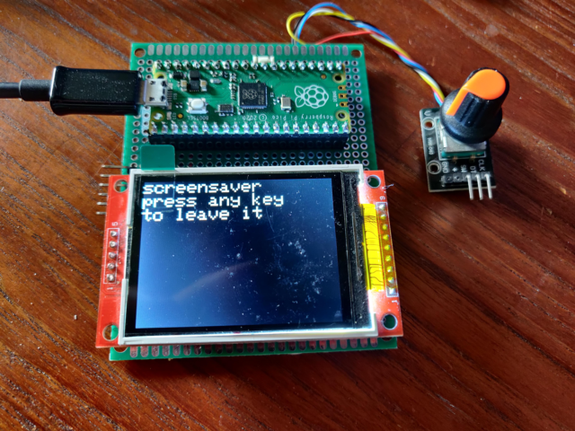
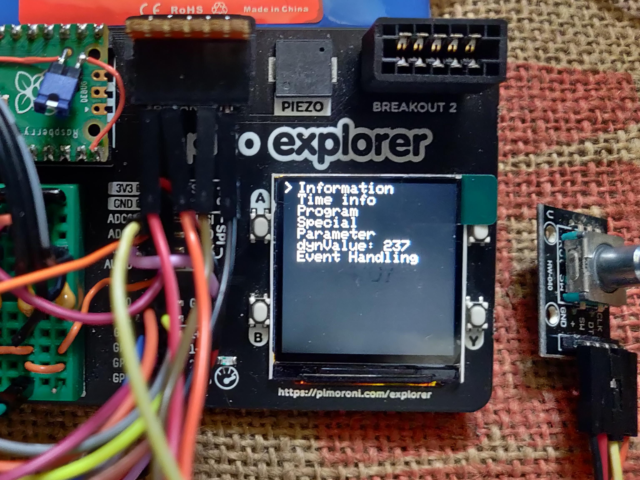

# Pico2040-LCD-Encoder-Menu
Versatile combination of prebuilt libraries to make menu system for Pico 2040 driven by rotary encoder.

## Libraries used:

 * LCD MENU library
 
  [https://github.com/Jomelo/LCDMenuLib2](https://github.com/Jomelo/LCDMenuLib2)

 * TFT graphics library

  [https://github.com/Bodmer/TFT_eSPI](https://github.com/Bodmer/TFT_eSPI)

 * Rotary Encoder library

  [http://www.mathertel.de/Arduino/RotaryEncoderLibrary.aspx](http://www.mathertel.de/Arduino/RotaryEncoderLibrary.aspx)

## Arduino demo

[Sketch directory](./Software/pico_LCDML_TFT_eSPI_Encoder)

[video-demo](https://youtu.be/AqM24sPe7YE)

